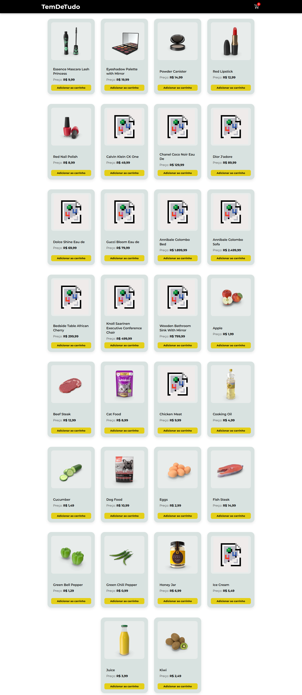
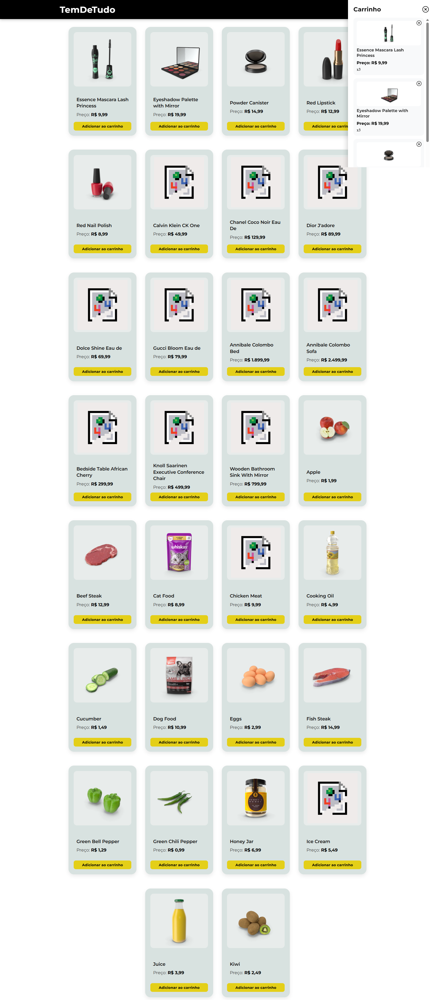

# 🛒 TemDeTudo - E-commerce React

## 📌 Sobre o projeto

O **TemDeTudo** é um projeto de e-commerce desenvolvido com **React**, com foco em praticar conceitos essenciais do front-end moderno como consumo de API, gerenciamento de estado, componentes reutilizáveis e manipulação de dados.

A aplicação permite visualizar produtos, adicionar itens ao carrinho, controlar quantidades, remover produtos e salvar os dados no navegador.

---

## 🚀 Funcionalidades

✅ Listagem dinâmica de produtos via API
✅ Carrinho lateral interativo
✅ Adicionar produtos ao carrinho
✅ Incremento automático de quantidade
✅ Remover produtos do carrinho
✅ Cálculo automático do valor total
✅ Preços formatados em Real (BRL)
✅ Persistência com LocalStorage
✅ Loading durante carregamento da API
✅ Interface responsiva e moderna

---

## 🛠️ Tecnologias utilizadas

* React
* JavaScript (ES6+)
* CSS3
* Axios
* React Icons
* LocalStorage

---

## 🌐 API utilizada

Os produtos são consumidos da API pública:

DummyJSON

---

## 📂 Estrutura do projeto

```text
src/
 ├── components/
 │   ├── Header.jsx
 │   ├── ListaProdutos.jsx
 │   └── Cart.jsx
 │
 ├── App.jsx
 ├── main.jsx
 └── styles/
```

---

## 🧠 Conceitos praticados

Durante o desenvolvimento foram aplicados conceitos importantes como:

* useState
* useEffect
* Props
* Renderização condicional
* map()
* filter()
* find()
* reduce()
* Spread Operator
* Componentização
* Persistência de dados

---

## ▶️ Como rodar o projeto

### Instalar dependências

```bash
npm install
```

### Rodar aplicação

```bash
npm run dev
```

---

## 📸 Preview

Preview do Projeto




---

## 📈 Objetivo

Este projeto foi desenvolvido com foco em evolução prática como desenvolvedor front-end, simulando funcionalidades comuns de um e-commerce real.

---

## 👨‍💻 Autor

Desenvolvido por Antonio Costa.
